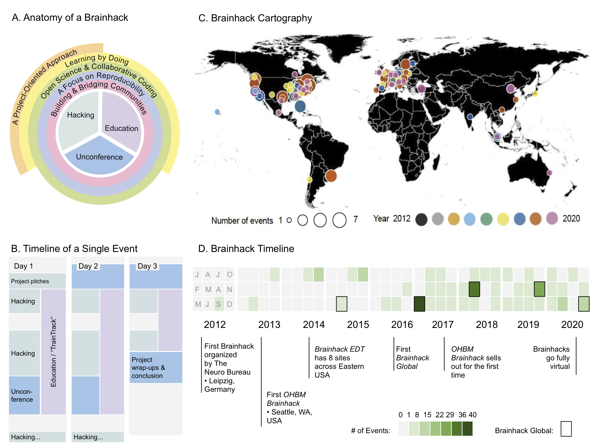

---
jupytext:
    text_representation:
      format_name: myst
kernelspec:
    display_name: Python 3
    language: python
    name: python3
  repository:
      url: https://github.com/brainhackorg/brainhack_jupyter_book
---

# Overview

The Brainhack Jupyter book has been written by the Brainhack community, as a continuously growing resource for the past and future of Brainhacks. Built together, it documents the achievements and organization of previous events around the world, and aims to instigate events and initiatives towards an open, inclusive, and community-driven neuroscience.

Not subject to the same space restrictions as the NeuroView, the book can become a place where all our ideas can live, illustrated with several projects reflecting the colorful range of interests across the entire community.

Over the next few months, we aim to write the book as a combination of elements from the short paper, the initial section drafts, the large pool of ideas from our brainstorming sessions, and the great variety of projects, born in Brainhacks and led by the team effort of numerous Brainhackers. Please join our efforts <3

We could draw inspiration from the structure of the short paper, which describes Brainhack features:

> "1) [a Project-Oriented Approach](a-project-oriented-approach) that fosters active participation and community-driven problem-solving; 2) [Learning By Doing](learning-by-doing), which enables participants to gain more intensive training, particularly in computational methods commonly featured at Brainhacks; 3) training in [Open Science & Collaborative Coding](open-science-&-collaborative-coding) which helps participants become more effective collaborators across contexts; 4) [A Focus on Reproducibility](a-focus-on-reproducibility) which leads to more robust scientific research; and 5) accelerated [Building and Bridging of Communities](building-and-bridging-communities) which encourages inclusivity and seamless collaboration between researchers at different career stages."

And where we aim to show that

> "Brainhacks and similar formats are increasingly recognized as a new way of doing science that extends traditional academic settings. These events foster a new research culture that demands open science and celebrates diversity, unlocking opportunities for scientific progress."

The Jupyter Book journey only begins… ✨🚀✨

---

